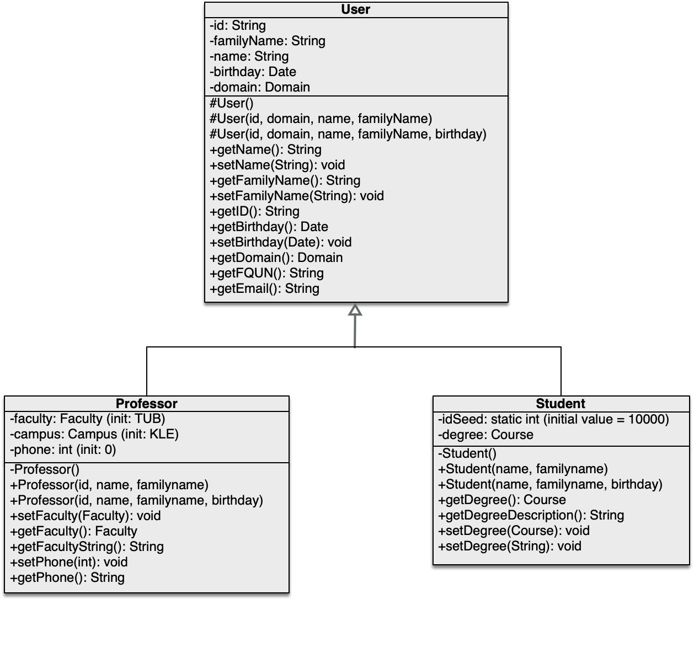
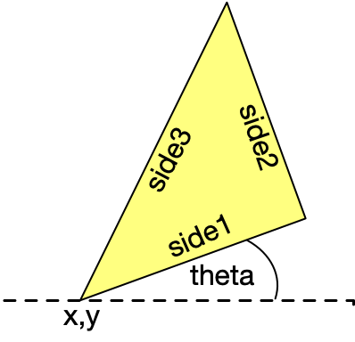
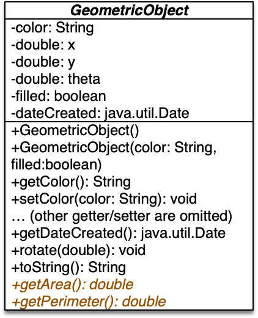

# OOP - WS 2023/24 - Exercise 05

## Object Oriented Programming - 2309 - Prof. Ronny Hartanto

 

---  

### Maximum number of "**commit/push**" for this exercise is **5**
 
> If you commit/push into the repository more than 5 times, you will not get any points for this exercise. 
> Initially, github will create your repository by filling it up with necessary contents. Therefore, you will start with x commits. The commit/push limitation is counted toward your commits, thus you should not exceed the x + 5 commits in total to receive the points for this exercise. 

--- 

## Assignments

1. Extend the **Student** class implementation from exercise 3 with the **Professor** and **User** classes using generalization as depicted in the UML-Diagram below. 

 

* The *idSeed* has value 10000 initially and keep incrementing for every new student object instantiated. The student’s id is assigned during instantiation using current *idSeed* value before increment. The *Course* is data type enumeration with the following content: ME, MSE, EL, IE, BMS, SCB, MME, MBB. This datatype already provided in the project folder. It is also possible to set the studycourse using a string value like “IE” or “EL”, etc. The study course description will return a complete human readable study course, i.e., ME = “Mechanical Engineering, B.Sc.”, MME=”Mechanical Engineering, M.Sc.”, MBB=”Bionics, M.Sc.”, (plese refer to actual study program in our faculty: https://www.hochschule-rhein-waal.de/en/faculties/technology-and-bionics/degree-programmes).

* The *Domain* is data type enumeration with the following content: STAFF, STUDENT. The value domain cannot be set from anywhere, but it will be derived from the class where the instance belongs to, i.e., Professor will have a domain value of STAFF and Student will have a domain value of STUDENT.

* The *Faculty* is data type enumeration with the following content: TUB, LS, GO, KU. 
* The *Campus* is data type enumeration with the following content: KLE, KL. Similar like domain, campus value cannot be set manually but its value will be derived from the faculty value, i.e., (KLE for TUB, LS, and GO) and (KL for KU).

* The *getFQUN()* method will return a full qualified user name that is a concatenation of the “id@staff.hsrw” (for Professor) and “id@student.hsrw” (for Student)

* The *getEmail()* method will return the e-mail address of the instance. The domain for the e-mail depends on the class, i.e., "name.familyName@hsrw.org" (for Student) and "name.familyName@hochschule-rhein-waal.de" (for Professor). 

* The method *setPhone()* in the Professor class accepts only the extension of the phone number (three or four digits).

* The method *getFacultyString()* will return the name of the faculty in string, i.e., TUB is “Technology and Bionics”, LS = “Life Sciences”, GO = “Society and Economics” and “KU” = “Communication and Environment”.

* The method *getPhone()* will return a full phone number in a string format, this value depends on the campus location, i.e., KLE will return “+49 2821 806 73 XXX” and KL will return “+49 2842 908 XXX”, where XXX is either the three or four digits number from the phone variable.  

  Implement the classes as described above, create all necessary java files by yourself. (Hints: use java.util.Date for the Date)

2. Design a class named **Triangle** that extends **GeometricObject**. (see UML diagram below for the description of the GeometricObject class.) The class contains:
* Three double data fields named *side1*, *side2*, and *side3* with default values 1.0 to denote three sides of a triangle. The default value for *color* is white and not filled. The default values for x,y, and theta are 0. 
* A no-arg constructor that creates a default triangle. 
* A constructor that creates a triangle with the specified *side1*, *side2*, and *side3*.
* A constructor that creates a triangle with the specified *side1*, *side2*, *side3*, *x*, *y*, and *theta*. x, y, and theta are variables for the origin of the first point of the triangle and orientation with respect to x-axis. Theta is in radians. Please see figure below for better illustration. 

* A constructor that creates a triangle with the specified *color*, *filled*, *side1*, *side2*, *side3*, *x*, *y*, and *theta*. (Pay attention, the order of the arguments are exactly like their appearance on the description.)

* The accessor and mutator methods for all data fields.
* The method *getArea()* returns the area of this triangle.
* The method *getPerimeter()* returns the perimeter of this triangle.
* The method *rotate(theta)* with argument angle in radians to rotate the triangle with angle theta about the origin (x,y). This method will also change the theta attribute of the object.

* The method *toString()* that returns the coordinates of the triangle's points. The first side of the triangle is always aligned with x+ axis of a cartesian coordinate with angle theta. The coordinates are separated with comma without any space in between. The values of the coordinates always in form of two digits decimal value. For example, a triangle with side1 = 1, side2 = 1, side3 = 1.41 and theta = 1.57 with origin (0,0) will return: *(0.00,0.00),(0.00,1.00),(-1.00,1.00)*.

 

3. Finally, refactor the **RegularPolygon** class from previous exercise to be a subclass of **GeometricObject**. The following is the previous description of the class: 
* A private *int* data field named *n* that defines the number of sides in the polygon with default value 3.
* A private *double* data field named *side* that stores the length of the side with default value 1.
* A private *double* data field named *x* that defines the x-coordinate of the polygon’s center with default value 0.
* A private *double* data field named *y* that defines the y-coordinate of the polygon’s center with default value 0.
* A no-arg constructor that creates a regular polygon with default values.
* A constructor that creates a regular polygon with the specified number of sides and length of side, centered at (0, 0), in that order. If the user call the method using invalid argument, the default value will be used instead. (Hint: the constructor has two arguments only)
* A constructor that creates a regular polygon with the specified number of sides, length of side, and x- and y-coordinates, in that order. It the user call the constructor with invalid values for sides or length, it will create an object using default value for invalid argument but the x- and y-coordinates arguments from the user will always be used. (Hint: minimum value for side is 3).  
* **(new)** A new constructor that creates a regular polygon with the following arguments: color, filled, number of sides, length of side, x- and y-coordinates, and theta. (in the same order)
* The accessor and mutator methods for all data fields.
* The method *getPerimeter()* that returns the perimeter of the polygon.
* The method *getArea()* that returns the area of the polygon. The formula for computing the area of a regular polygon is  

* **(updated)** The method *toString()* that returns the coordinates of the polygon's points. The first segment of the polygon is always aligned with x+ axis of a cartesian coordinate. The coordinates are separated with comma without any space in between. The values of the coordinates always in form of two digits decimal value. For example, a polygon which has four sides with length of 1 with origin (0,0) and theta = 0 will return: *(0.00,0.00),(1.00,0.00),(1.00,1.00),(0.00,1.00)*. Pay attention that the coordinates are influenced by *theta*. 
  
  Draw the UML diagram that includes this class, **Triangle** class and **GeometricObject** class. Implement this class in the same folder as previous question. Upload the UML diagram in the UML folder. 
---

## Instruction
You have to work on your local machine to do this exercise. Don't use the WebIDE as it will use up your "commit/push" tokens. 

**Please follow the following steps:**
1. Clone the repository into your local computer. (you can use terminal or any Git client)
2. Open the local repository on your local computer using your favourite editor (text editor or IDE)
3. Work on your assigment solve all the given problem, make sure they run on your computer. **Don't change the structure of the directory**
4. If you completed all the assigments, *commit* your change to Git and *push* it to the Github (using your GitClient or terminal)
5. Check your submission by visiting your Github repository, after a while you should be able to see the result (:white_check_mark: or :x:)
6. If you have :white_check_mark: then you are done with your exercise, otherwise repeat step 3 onward. 

--- 

## Important

You can ONLY change files inside the **src/main/java** folder and place your name in this readme file. Depending on your task, you might need to create a new class in the **src/main/java** folder. Please don't make any modification anywhere else. 

**Make sure you submit your exercise before the deadline.** 
> If you submit after the deadline, it will not be graded

---
## Notes
* **WS2023/24** The points are not part of the final assessment. This purely exercise to help you learn Java programming.
* The submission will be evaluated automatically (most of the case)!
* If it doesn't compile, it could be some mistakes on your submission. (no points will be awarded in this case)
* You will receive the points upon successful solving the tasks. 
* You can make or modify your submission before the deadline
* Make sure you don't exceed the limit, sometime it's better to get partial points than exceeding the limit. 
* Use this exercise to practice your programming skill
